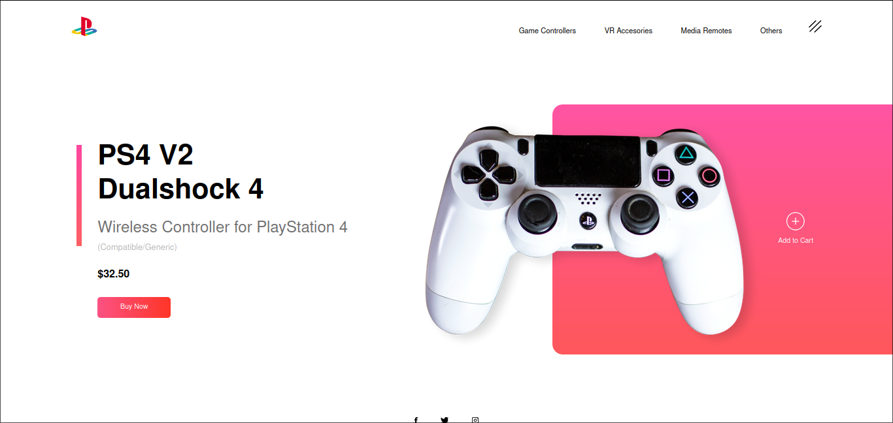

# A minimal Responsove Web Design

Hi here mrp4sten and in this time I've make this simple page to practice _Responsive Design_ using **Media Queries** and **Animations**.

## What use?

- HTML 5
- CSS3
- JS

### Preview

